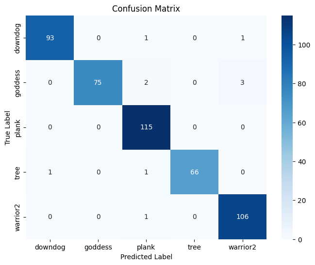

# Yoga-Pose-Detecion-and-Correction-System

This project detects yoga poses and provides correction feedback using image or video inputs. Built with Python, MediaPipe, OpenCV, and Scikit-learn, the model identifies the pose using angle calculations between key joints and classifies it with a Support Vector Machine (SVM). It also gives feedback when the posture is incorrect based on deviation from ideal angles.

---

## Problem Statement

Many people practice yoga incorrectly without professional guidance, which can lead to reduced effectiveness or injuries. This project automates the detection and correction of yoga postures in real-time to guide practitioners in maintaining correct form.

---

## Objectives

- Detect human pose landmarks using **MediaPipe**.
- Extract joint angles to represent yoga postures numerically.
- Train an **SVM classifier** to recognize different yoga poses.
- Provide **correction feedback** by comparing user's posture with ideal poses using CSV-based references.
- Support both **images** and **videos** for input.
- Generate output with **annotated poses and correction tips**.

---

## Tech Stack

| Tool         | Purpose                          |
|--------------|----------------------------------|
| Python       | Core programming language        |
| OpenCV       | Image & video processing         |
| MediaPipe    | Pose landmark detection          |
| scikit-learn | SVM training & evaluation        |
| Pandas/NumPy | Data handling                    |
| Matplotlib   | Visualizing results (confusion matrix, etc.) |
| MoviePy      | Convert frame images to output video |


---

## How It Works

1. Pose Detection:
   - MediaPipe detects 33 keypoints (landmarks) on the human body.
   - Relevant joints are selected to compute angles (e.g., elbow, shoulder, hip, knee).

2. Angle Feature Extraction:
   - Angles are calculated between 3 connected joints using trigonometry.
   - This forms a feature vector representing the pose.

3. Pose Classification:
   - An **SVM (Support Vector Machine)** classifier is trained using the angles dataset (`angle_train.csv`).
   - It predicts the yoga pose (e.g., Warrior, Tree, Goddess) for new images or videos.

4. **Pose Correction:
   - Compares the user's angles with ideal pose angles from `angle_train.csv`.
   - If deviation > threshold (e.g., 30°), it marks joints as "less", "more", or "OK".
   - Displays feedback directly on the image/video.

---


---

## Sample Outputs

### Interface
 

### Pose Prediction (Image Input)


This shows the predicted yoga pose ("Warrior") with pose landmarks overlaid.

---

### ✅ Pose Correction (Image Input)


Here, joint-wise feedback is given for each landmark (e.g., L-knee: more, R-shoulder: OK), making it easy to improve posture.

---

### ✅ Confusion Matrix


Model accuracy: **97.85%**  
Confusion matrix visualizes the true vs predicted poses.

---

### ✅ Pose Prediction (Video Snapshot)


Pose is predicted for each frame of a video, and the final output is exported as an annotated video.

## Model Performance

- Classifier used: `SVC(kernel='rbf', probability=True)`
- Evaluation Metric: **Accuracy**
- **Test Accuracy:** `97.85%`
- Confusion Matrix visualized for multi-class classification.

---

## How to Run

### On Google Colab
1. Open the notebook in Google Colab.
2. Upload `angle_train.csv`, `angle_test.csv`, and model files to the session or mount Google Drive.
3. Run all cells in order.
4. Use `predict()` for image and `predict_video02()` for video pose detection.
5. Use `correct_feedback_image()` and `correct_feedback()` for correction.

### Locally
```bash
# Install dependencies
pip install -r requirements.txt

# Run the notebook
jupyter notebook yoga_pose_detection_and_correction.ipynb


